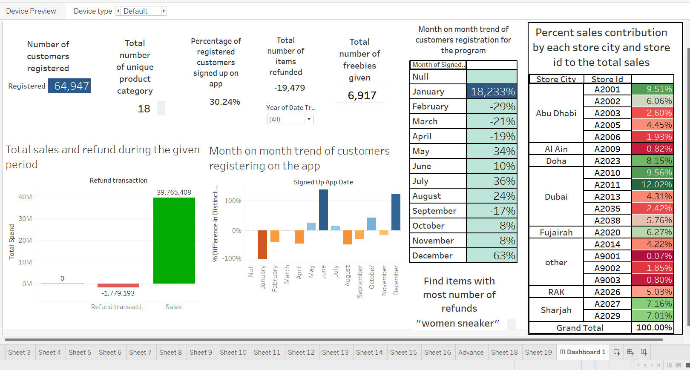

# Business Case Loyalytics

### Dashboard:

### Context:
Loyalytics is an AI and analytics company helping some of the world's leading brands solve their complex data challenges. Their end-to-end platform enables companies to leverage the power of data to craft strategies, create engaging customer experiences, and drive measurable business impact. They were voted one of the best CRM solutions provider in India by the CIO Review magazine in the year 2019. 

### Objective:
Analyze the sales data from the past 2 years and give recommendations to the brand in order to improve performance in the future. We would like you to make a recommendation video of a maximum of 3 minutes and share this with us. 
Dataset Link This dataset has information on more than 500k transactions from 2020 to 2022 at brand A across different stores in UAE and Qatar. 

The Dataset has the following features:

### [Dataset](https://github.com/AbhinavTalmale/Business-Case-Loyalytics/tree/main/Dataset)

| Features                       | Description                                                                                                 |
|--------------------------------|-------------------------------------------------------------------------------------------------------------|
| `customer_Id`                  | Unique identifier for a customer for a given transaction. Blank for non-loyal transactions                   |
| `current Tier`                 | Categorizes customers based on purchase history                                                             |
| `customer_nationaity`          | Nationality of the customer                                                                                 |
| `date_transacted`              | Date of the transaction                                                                                     |
| `storeId`                      | Store from where the transaction has happened                                                               |
| `store_city`                   | City where the store is located                                                                             |
| `transactionId`                | Similar to a receipt ID in a store, identifying a particular transaction (can be repeated)                  |
| `itemid`                       | ID of the item                                                                                              |
| `Brand`                        | Name of the brand (A)                                                                                       |
| `itemName`                     | Name of the item                                                                                            |
| `product_category`             | Category under which the product falls                                                                      |
| `high_level_product_category`  | Broader categories of `product_category`                                                                    |
| `quantity`                     | Total quantity of the item the customer purchased                                                           |
| `total_spend`                  | Total amount the customer spent on that item within that transaction                                        |
| `signed_up_loyalty_program_date` | Date that the customer signed up for a loyalty program. Blank if the customer has not registered             |
| `signed_up_app_date`           | Date that the customer signed up on the mobile application. Blank if the customer does not have the app     |

